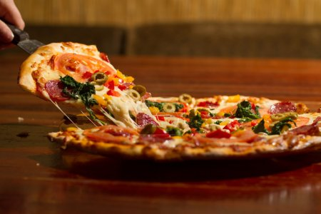
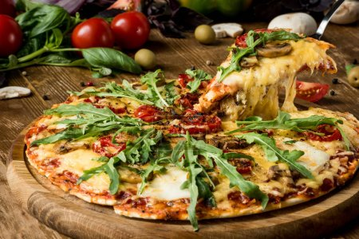
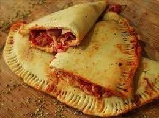
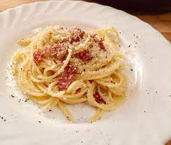
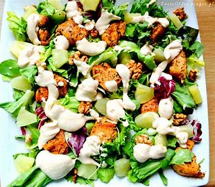
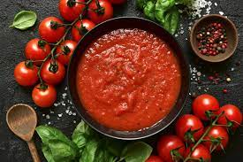

# Menu

## pizze klasyczne

|Lp. |                                        pizza                | rozmiar | 30cm |50cm | 60cm |
|----|-------------------------------------------------------------|---------|------|-----|------|
|1.  |                                    MARGHARITA(sos,ser,pizza)|         | 20zł | 40zł| 50zł |
|2.  |                              FUNGHI(sos,ser,pieczarki,pizza)|         | 22zł | 42zł| 52zł |
|3.  |                           SALAMI(sos,mozarella,salami,pizza)|         | 23zł | 43zł| 53zł |
|4.  |                                    VESUVIO(sos,2xser,szynka)|         | 24zł | 44zł| 54zł |      
|5.  |                              HAWAJSKA(sos,ser,szynka,ananas)|         | 25zł | 45zł| 55zł |
|6.  |                       MILANO(sos,ser,szynka,papryka,oregano)|         | 26zł | 46zł| 56zł |
|7.  |                           KEBAB(sos,ser,kebab,sos czosnkowy)|         | 26zł | 46zł| 56zł |
|8.  |                         QUATTRO FROMAGGI(sos,4 sery,oregano)|         | 27zł | 47zł| 57zł |
|9.  |                         GRECKA(sos,ser,oliwki,sałata lodowa)|         | 28zł | 48zł| 58zł |
|10. | BARBEQUE(sos,ser,kurczak,boczek,cebula,sos barbeque,oregano)|         | 30zł | 50zł| 60zł |

## pizze wegetariańskie

|Lp. |                                        pizza                | rozmiar | 30cm |50cm | 60cm |
|----|-------------------------------------------------------------|---------|------|-----|------|
|1.  |                                    MARGHARITA(sos,ser,pizza)|         | 20zł | 40zł| 50zł |
|2.  |                              FUNGHI(sos,ser,pieczarki,pizza)|         | 22zł | 42zł| 52zł |     
|3.  |                                HAWAJSKA VEGE(sos,ser,ananas)|         | 25zł | 45zł| 55zł |
|4.  |                         MILANO VEGE(sos,ser,papryka,oregano)|         | 26zł | 46zł| 56zł |
|5.  |                         GRECKA(sos,ser,oliwki,sałata lodowa)|         | 28zł | 48zł| 58zł |

## pizza calzone (zwinięta w pieróg)

|Lp. |                                        pizza                | rozmiar | 30cm |50cm | 60cm |
|----|-------------------------------------------------------------|---------|------|-----|------|
|1.  |                           KEBAB(sos,ser,kebab,sos czosnkowy)|         | 26zł | 46zł| 56zł |
|2.  |                         GRECKA(sos,ser,oliwki,sałata lodowa)|         | 28zł | 48zł| 58zł |
|3.  | BARBEQUE(sos,ser,kurczak,boczek,cebula,sos barbeque,oregano)|         | 30zł | 50zł| 60zł |

## makarony

|Lp. |                                      makaron                | porcja  | 500g | 650g |
|----|-------------------------------------------------------------|---------|------|------|
|1.  |           SPAGHETTI NAPOLI(z sosem pomidorowym i serem)     |         | 26zł | 46zł |
|2.  |            SPAGHETTI BOLONIA(z sosem bolońskim)             |         | 28zł | 48zł |
|3.  |            SPAGHETTI CARBONARA(z sosem carbonara)           |         | 30zł | 50zł | 

## sałatki

1. Cezar(sałata, cebula, oliwa z oliwek, pomidor) - 15zł
2. Grecka(sałata, cebula, oliwa z oliwek, pomidor, oliwki, feta) - 20zł
3. Hiszpańska(sałata, cebula, oliwa z oliwek, pomidor, oliwki, mozarella) - 25zł

## sosy

1. Czosnkowy - 5zł
2. Pomidorowy - 5zł
3. Barbeque - 5zł
4. Sezamowy - 5zł
5. Majonezowy - 5zł

## napoje
 
 

|Lp. |   napój           | pojemność  |330ml |500ml |
|----|-------------------|------------|------|------|
|1.  |  Woda             |            |  5zł | 10zł |
|2.  |  Sok pomarańczowy |            |  7zł | 12zł |
|3.  |  Sok jabłkowy     |            |  7zł | 12zł | 
|4.  |  Piwo jasne       |            | 10zł | 15zł |
|5.  |  Piwo ciemne      |            | 12zł | 17zł | 
